# AI Revenue Recovery — System Design

> Canonical technical document.  
> Version: v1.0 — auto-generated from live implementation.  
> Source of truth: repository code, tests, database models, and API routes.

---

## Table of Contents

1. [Problem Statement](#1-problem-statement)
2. [Why This Is Revenue Recovery, Not Refund Recovery](#2-why-this-is-revenue-recovery-not-refund-recovery)
3. [Expected Value Economics](#3-expected-value-economics)
4. [Intervention Cost Modeling](#4-intervention-cost-modeling)
5. [Hard Safety Rules vs Economic Decisioning](#5-hard-safety-rules-vs-economic-decisioning)
6. [Longitudinal Customer Intelligence](#6-longitudinal-customer-intelligence)
7. [Checkout Abandonment Flow](#7-checkout-abandonment-flow)
8. [Recovery Attribution](#8-recovery-attribution)
9. [Razorpay Integration Lifecycle](#9-razorpay-integration-lifecycle)
10. [Agentic Architecture](#10-agentic-architecture)
11. [ML Pipeline](#11-ml-pipeline)
12. [Synthetic Benchmark](#12-synthetic-benchmark)
13. [LLM / Voice Layer](#13-llm--voice-layer)
14. [Frontend Dashboard](#14-frontend-dashboard)
15. [Database and Data Model](#15-database-and-data-model)
16. [API Design](#16-api-design)
17. [System Diagrams](#17-system-diagrams)
18. [Non-Functional Requirements](#18-non-functional-requirements)
19. [Honest Limitations](#19-honest-limitations)
20. [Future Scope](#20-future-scope)

---

## 1. Problem Statement

Merchants lose unrealized revenue when a customer initiates checkout, a payment fails, and the merchant does not act promptly or intelligently to recover the sale.

This system addresses that gap for a single merchant in Razorpay Test Mode:

1. Merchant creates a Razorpay order.
2. Customer attempts payment via Razorpay Standard Checkout.
3. Payment fails due to a transient or structural error.
4. The backend receives a `payment.failed` webhook and triggers the AI Recovery Agent.
5. The agent evaluates whether and how to intervene (RETRY / WAIT / STOP / SWITCH_PAYMENT_METHOD).
6. A `payment.captured` webhook closes the loop with recovery attribution.

**Scope:** Merchant-facing dashboard only. Customer-facing payment experience remains Razorpay Standard Checkout; it is not replaced or duplicated.

---

## 2. Why This Is Revenue Recovery, Not Refund Recovery

| Dimension | This System |
|-----------|-------------|
| Money direction | Merchant ← Customer (unrealized revenue capture) |
| Trigger | Payment failed before capture |
| Goal | Recover a valid sale that was interrupted |
| Not this | Refund, chargeback, dispute, or customer-money return |

Recovery is recognized only when a subsequent capture occurs on the **same Razorpay order** after a prior failed attempt and an active recovery intervention.

---

## 3. Expected Value Economics

### EV Formula

The decision engine (`ml/decision_engine.py`) computes:

```
probability              = CatBoost.predict_proba(features)[1]
expected_recovered_value = probability x amount
attempt_penalty          = 0.75 ^ max(0, attempt_number - 1)
adjusted_ev              = expected_recovered_value x attempt_penalty
net_expected_value       = adjusted_ev - intervention_cost
```

### Key Properties

| Property | Value | Implication |
|----------|-------|-------------|
| `probability` | 0-1 (CatBoost output) | EV < amount because probability < 1 |
| `attempt_penalty` at attempt 1 | 1.0 | Initial failure is **not** an intervention; no reduction |
| `attempt_penalty` at attempt 2 | 0.75 | First real recovery attempt: 25% reduction |
| `attempt_penalty` at attempt 3 | 0.5625 | Second recovery attempt: 43.75% reduction |
| `attempt_penalty` at attempt 4 | 0.421875 | Third recovery attempt: 57.8% reduction |

**Strictly decreasing:** EV(n+1) < EV(n) for all n when factor < 1 and probability is constant. Verified by `test_diminishing_returns_ev_strictly_decreasing_across_all_attempts`.

### Decision Thresholds

```
DecisionPolicy:
  intervention_cost         = 25.0     # fixed internal cost
  wait_cost                 = 0.0      # no cost for WAIT signal
  retry_min_net_value       = 50.0     # net_ev >= 50 -> RETRY or WAIT
  wait_min_net_value        = 10.0     # 10 <= net_ev < 50 -> WAIT
  diminishing_return_factor = 0.75
  max_wait_minutes          = 120
  max_attempts              = 4
```

| `net_expected_value` | Time since failure | Failure type | Decision |
|----------------------|--------------------|-------------|----------|
| >= 50 | > 30 min | any | RETRY |
| >= 50 | <= 30 min | transient | WAIT (cooling window) |
| >= 50 | <= 30 min | non-transient | RETRY |
| 10-49 | any | any | WAIT |
| < 10 | any | any | STOP |

---

## 4. Intervention Cost Modeling

The `intervention_cost = 25.0` is a **simplified, fixed internal accounting unit** (in paise). It is intentionally not derived from real Razorpay processing fees for the following reasons:

- Razorpay processing fees are settlement-side charges, not per-intervention costs.
- The actual cost of an intervention in the real system is mostly operational (staff, time, message delivery).
- The value `25` is a threshold that makes economic sense relative to the order amounts in the dataset (orders range from ~Rs.200 to ~Rs.1,80,000).
- Changing this value shifts the RETRY/WAIT/STOP decision boundary but does not change the fundamental economic model.

**What the cost represents:**
- Cost of triggering a recovery attempt (overhead, risk of friction, opportunity cost).
- Does **not** represent: Razorpay payment processing fees, SMS/email/voice delivery cost.

**What it is not:**
- A real payment fee charged to the merchant or customer.
- A customer-facing charge.

---

## 5. Hard Safety Rules vs Economic Decisioning

There are **two layers** of decision logic. Hard safety guards always override economics.

### Layer 1: Hard Safety Guards (non-negotiable)

Checked **before** any EV calculation in `AIDecisionEngine.decide()`:

| Condition | Guard | Source |
|-----------|-------|--------|
| `already_paid == True` | STOP immediately | `case.already_paid` from order status |
| `failure_code in NON_RECOVERABLE_FAILURE_CODES` | STOP immediately | `synthetic_world.py` |
| `attempt_number >= max_attempts` | STOP immediately | `config.MAX_RECOVERY_ATTEMPTS = 4` |

Non-recoverable failure codes: `AUTHENTICATION_ERROR`, `INSUFFICIENT_FUNDS`, `CARD_DECLINED`, `BANK_DECLINED`, `INVALID_ACCOUNT`, `CURRENCY_NOT_ALLOWED`.

### Layer 2: Economic Decisioning

Only reached after all safety guards pass. Uses the EV formula above to choose RETRY / WAIT / STOP.

### Layer 3: Agent-Level Guards

The `RecoveryAgent` adds additional guards:
- If all payment methods have failed >= 2 times: STOP.
- Re-checks `evaluate_recovery_policy()` (DB-backed attempt count) before executing RETRY.

---

## 6. Longitudinal Customer Intelligence

### What it is

The system queries the **persisted SQLite database** for all `PaymentAttempt` records belonging to the same `customer_id` across multiple `MerchantOrder`s. This is real cross-order history, not a synthetic profile.

### Exact data flow

```
PaymentAttempt (DB)
  -> get_customer_payment_history(
       db, customer_id,
       exclude_order_id=current_order.internal_id,
       exclude_attempt_id=current_failed_attempt.internal_id
     )
       -> CustomerPaymentHistory
            -> injected into _build_case_dict() in agent.py
                 -> case_dict["customer_total_orders"] triggers DB override
                      in enrich_case_features()
                      -> CatBoost.predict_proba(features)
                           -> DecisionOutcome.recovery_probability
```

### Exclusion rules

- **Current order excluded** (`exclude_order_id`): current-order attempts are not counted as historical evidence.
- **Current failed attempt excluded** (`exclude_attempt_id`): the attempt that triggered this evaluation is not counted.
- These rules prevent data leakage from future/current state into the decision.

### CustomerPaymentHistory fields

```
total_attempts          # across all prior orders
successful_attempts
failed_attempts
success_rate            # successful / total
attempts_by_method      # dict: method -> count
successes_by_method
failures_by_method
method_success_rates    # dict: method -> success_rate
customer_average_order_value
customer_total_spend
customer_last_success_age  # minutes since last successful payment
customer_last_failure_age
most_recent_successful_method
most_recent_failed_method
```

### Bridge: live history -> ML features

When `customer_total_orders` key is present in `case_dict`, `enrich_case_features()` (in `ml/shared_semantics.py`) overrides the synthetic customer profile with database-backed values. This is the live->ML bridge.

### Impact on decisions

Two customers with identical payments but different histories **will receive different decisions**:
- Customer A (CARD 90% success rate): higher `calculate_latent_recovery_score` -> higher RETRY probability.
- Customer B (CARD 10% success rate): lower score -> may result in SWITCH or STOP.

---

## 7. Checkout Abandonment Flow

Abandonment occurs when a customer opens checkout but does not attempt payment at all. There is no `payment.failed` event.

### Flow

```
Frontend (JS):
  checkout.on("dismiss") or idle timeout
    -> POST /payments/order/{razorpay_order_id}/abandon

Backend (payments.py):
  1. Guard: if order.status == "paid" -> already_paid
  2. Guard: if PaymentAttempt exists -> use payment recovery instead (HTTP 409)
  3. mark_order_abandoned(db, order)
     -> creates RecoveryAction(action_type="abandonment_candidate")
     -> order.status = "abandoned"
  4. RecoveryAgent.observe_abandonment(order)
     -> evaluates all methods via AI
     -> no payment attempt is fabricated
     -> creates AgentTrace(event="checkout.abandoned")
```

### Important constraint

No `PaymentAttempt` is fabricated for a pure abandonment. The system only tracks checkout abandonment as a `RecoveryAction` with type `abandonment_candidate`. This ensures the data model stays honest.

---

## 8. Recovery Attribution

Attribution determines whether a captured payment is "recovered revenue" or "natural revenue."

### Attribution logic (`agent.py: verify_captured`)

```
payment.captured webhook received:
  has_failed_attempt? (prior failed PaymentAttempt on same order)
  has_pending_recovery_action? (recovery_retry_pending, status in {pending, active})

  if (has_failed_attempt OR has_abandonment_candidate) AND has_pending_action:
    -> RECOVERY_SUCCESS (attribute revenue to intervention)
  else:
    -> NATURAL_SUCCESS (customer paid without intervention)
```

### Same order ID / new payment ID rule

Razorpay allows multiple payment attempts on the same order. The system uses:
- `razorpay_order_id` -> links attempt to order.
- `razorpay_payment_id` -> unique per payment attempt (different for retry vs original).
- Recovery checks `attempt_number < current_attempt.attempt_number` to confirm a prior failure existed.

### Idempotency

- `mark_recovery_success` checks for existing `recovery_success` action before creating a new one.
- Webhook events are deduplicated by `razorpay_event_id` stored in `WebhookEvent`.

---

## 9. Razorpay Integration Lifecycle

### Order creation

```
POST /orders
  -> create_razorpay_order(amount, currency, receipt, notes)
  -> Razorpay Orders API -> razorpay_order_id
  -> stored in MerchantOrder
  -> GET /config -> returns razorpay_key_id (public key only, never secret)
```

### Payment attempt

```
Frontend:
  Razorpay.open({order_id: razorpay_order_id, key: razorpay_key_id})
  -> customer pays or fails
  -> Razorpay sends webhook to /webhooks/razorpay
```

### Webhook handler

```
POST /webhooks/razorpay
  1. verify X-Razorpay-Signature using HMAC-SHA256(raw_body, RAZORPAY_WEBHOOK_SECRET)
  2. deduplicate by razorpay_event_id
  3. route by event type:
     payment.failed   -> if order already paid, returns already_paid without creating attempt
                         else -> PaymentAttempt(status=failed) + RecoveryAgent.observe_failure()
     payment.captured -> if already captured on paid order, returns already_processed
                         else -> upsert_payment_from_payload() + RecoveryAgent.verify_captured()
     order.paid       -> if already paid, returns already_processed
                         else -> RecoveryAgent.verify_order_paid()
```

### Retry / recovery checkout

The merchant **reuses the same `razorpay_order_id`** and re-opens Razorpay Standard Checkout. Razorpay allows multiple payment attempts on the same order until it is paid. The backend never creates a new Razorpay order for retry.

### Security

- `RAZORPAY_KEY_SECRET` is never sent to the frontend.
- `RAZORPAY_WEBHOOK_SECRET` is used only for HMAC verification server-side.
- Frontend only receives `razorpay_key_id` via `GET /config`.

---

## 10. Agentic Architecture

### Why an agent, not just a classifier

A pure classifier returns a probability. An agent:
1. **Observes** real context (order status, attempt count, customer history).
2. **Diagnoses** failure patterns (transient, repeated, method-specific degradation).
3. **Evaluates all available methods** (not just the failed one).
4. **Plans** the action with dynamic budgeting and switching logic.
5. **Executes** within bounded safety rails.
6. **Replans** on subsequent failures.
7. **Audits** every decision in `AgentTrace`.

### Agent loop (`observe_failure`)

```
RecoveryAgent.observe_failure(order, failed_attempt):
  1. OBSERVE   -> evaluate_recovery_policy() checks DB-backed attempt count
  2. DIAGNOSE  -> _diagnose() classifies: TRANSIENT / REPEATED / METHOD_SPECIFIC_DEGRADATION
  3. EVALUATE  -> for each available method (methods not failed >= 2 times):
                    _build_case_dict() with live customer history
                    AIDecisionEngine.decide() -> net_ev per method
  4. PLAN      -> choose best method by highest net_ev
                  if best_method != failed_method -> SWITCH_PAYMENT_METHOD
                  else -> RETRY or WAIT
  5. EXECUTE   -> execute_recovery_decision() creates RecoveryAction (bounded)
  6. PERSIST   -> AgentTrace saved with full decision inputs, evaluations, history
```

### Supported actions

| Action | Meaning |
|--------|---------|
| `RETRY` | Reopen checkout with same method |
| `SWITCH_PAYMENT_METHOD` | Reopen checkout with agent's recommended method |
| `WAIT` | Defer -- show waiting state, allow customer to choose |
| `STOP` | Terminal -- no further intervention |

### Bounded executor (`recovery_executor.py`)

The executor enforces:
- `max_attempts` hard cap (min of env and 4).
- Cannot RETRY/WAIT from `stopped` or `exhausted` terminal state.
- Idempotent execution: returns duplicate result if action already recorded for this attempt.
- Non-recoverable failure codes block RETRY at executor level (secondary guard).

### Agent trace persistence

Every agent decision is stored in `AgentTrace`:
- `event`, `diagnosis`, `decision_inputs` (JSON), `probability`, `expected_value`, `net_ev`
- `selected_action`, `planned_method`, `actual_payment_method`
- `execution_result`, `webhook_outcome`, `recovered_revenue`

Visible on merchant dashboard via `GET /payments/order/{id}/trace`.

---

## 11. ML Pipeline

### Synthetic training data

The ML pipeline generates synthetic training data because real labeled recovery data is not available. The synthetic world (`ml/generate_dataset.py`) uses:

1. Deterministic customer profiles keyed by `customer_id` MD5 hash.
2. Segment-biased failure code sampling (risky -> more INSUFFICIENT_FUNDS, etc.).
3. Target `recovery_success` generated by a **nonlinear logistic-style latent score** with realistic interactions and added Gaussian noise. The target function is intentionally independent of the baseline policy.

Training set: 50,000 cases, 3,000 synthetic customers, 6 random seeds.

### Model

**CatBoost Classifier**:
- `loss_function = Logloss`
- `eval_metric = AUC`
- `depth = 8`, `iterations = 700`, `learning_rate = 0.05`
- `early_stopping_rounds = 50`
- Native categorical support for `payment_method`, `failure_code`, `customer_history_segment`

Split: 70% train, 15% validation, 15% test -- **grouped by `customer_id`** to prevent data leakage.

### Feature set (20 features)

| Category | Features |
|----------|----------|
| Payment | `amount`, `payment_method`, `failure_code`, `attempt_number`, `time_since_failure` |
| Customer (overall) | `customer_total_orders`, `customer_successful_orders`, `customer_failed_orders`, `customer_success_rate`, `customer_failure_rate`, `customer_average_order_value`, `customer_total_spend`, `customer_last_success_age`, `customer_last_failure_age`, `customer_history_segment` |
| Customer (per-method) | `customer_method_attempts`, `customer_method_successes`, `customer_method_failures`, `customer_method_success_rate` |
| Context | `order_value_percentile_for_customer` |

### Latent score formula (for synthetic label generation)

```
base = -2.4
base += 0.8 x log(1 + amount/1000)          # higher amount -> more recoverable
base += 0.9 x (success_rate - 0.5)           # good history -> more recoverable
base += 0.6 x (0.5 - failure_rate)           # fewer failures -> more recoverable
base += 0.35  if segment == "strong"
base -= 0.25  if segment == "risky"
base += 0.45  if method in {upi, card}
base += 0.40  if transient failure code
base -= 0.50  if non-recoverable failure code
base -= 0.30 x (min(failed_orders, 8) / 8)  # failure history penalty
base -= 0.20  if attempt_number > 2
base += 0.18  if time_since_failure <= 60 AND transient
base += 0.15 x method_success_rate
base += 0.10 x order_value_percentile
probability = sigmoid(base + noise)
```

### Evaluation metrics

`evaluate.py` reports:
- ROC-AUC, PR-AUC, precision, recall (threshold=0.5)
- Brier score, calibration curve
- Confusion matrix
- Business metrics: recovered_orders, recovered_revenue, revenue_recovery_rate, intervention_rate

Model persisted at `ml/model/catboost_recovery_model.cbm`.

---

## 12. Synthetic Benchmark

### What it measures

The benchmark (`ml/benchmark_compare.py`) is a **capability comparison** between two policies over the same 1,000 synthetic cases (seed=42):

| Policy | Description |
|--------|-------------|
| **Baseline** | Deterministic: retry if attempt_number <= 2 and not non-recoverable |
| **AI Agent** | EV-based: CatBoost probability x amount x penalty - cost |

> **Critical caveat:** This is NOT a pure ML quality benchmark. The AI agent has:
> - A larger intervention budget (up to 4 attempts vs 2 for baseline).
> - Adaptive method switching.
> - Customer history features.
> - Economic net-EV thresholds.
>
> The comparison shows capability of the full system vs a simple rule, not raw model accuracy.

### Benchmark results (seed=42, n=1000, deterministic)

| Metric | Baseline | AI Agent | Lift |
|--------|---------|---------|------|
| Failed orders (candidates) | 361 | 361 | - |
| Revenue at risk | Rs.2,74,836 | Rs.2,74,836 | - |
| Recovered orders | 100 | 107 | +7 |
| Recovered revenue | Rs.72,292 | Rs.77,902 | +Rs.5,610 |
| Recovery rate | 27.70% | 29.64% | +1.94pp |
| Revenue recovery rate | 26.30% | 28.34% | +2.04pp |
| Recovery interventions | 120 | 130 | +10 |
| Unnecessary interventions | 0 | 0 | 0 |

> Revenue figures are in paise (divide by 100 for INR). All values deterministic at seed=42.
> AI revenue per additional intervention: Rs.561.

### Pre-realized outcomes

Both policies observe the **same pre-drawn ground truth** (`realized_outcomes` dict keyed by order_id). This ensures the comparison is a policy-only test: neither policy can change the underlying world. RNG alignment is maintained.

---

## 13. LLM / Voice Layer

### What it does

Generates a Hinglish (Hindi-English code-switched) voice message and renders it both visually and as synthesized speech in the browser (`window.speechSynthesis` with `SpeechSynthesisUtterance`, language `hi-IN`). The merchant or operator can click **"▶ Play Agent Voice"** on the dashboard to hear and inspect the recovery guidance. This is **communication-only**.

### What it explicitly does NOT do

- The LLM does **not** make financial decisions.
- The LLM does **not** change the agent's RETRY/WAIT/STOP decision.
- The LLM does **not** charge or commit anything on behalf of the customer.
- No API keys are exposed in the response.

### Architecture

```
GET /payments/order/{id}/voice-recovery
  -> build_voice_facts(scenario, decision, method, reason, customer_history)
       -> allowlisted dict (no probability, no net_ev, no financial internals)
  -> generate_recovery_message(facts)
       -> if LLM configured: POST to Groq API (groq/compound-mini)
            -> specialized spoken TTS prompt (no emojis, no bullet points, no jargon)
            -> sanitize_speech_text() strips emojis, symbols, markdown, and internal codes
       -> if LLM unavailable / invalid response: deterministic_fallback()
            -> sanitize_speech_text() applied to fallback
       -> validation: _valid_message() rejects emojis and forbidden words
          ("guaranteed", "charge", "net EV", "probability", "agent step", length > 280)
       -> returns: {message, source, provider_configured, model, facts}
```

### Speech Quality & Sanitization

To ensure high natural speech fidelity in Text-to-Speech (TTS):
- **Emoji stripping:** Emojis (such as 🙏, 👍, ✅) are stripped deterministically so TTS never speaks literal names like "folded hands" or "thumbs up".
- **Internal token removal:** Codes like `payment.failed`, `checkout.abandoned`, and `net EV` are removed from speech.
- **Pronunciation safety:** Awkward numbered step phrasing (e.g. `step 1` causing 'sa-tep' artifacts in some synthesizers) is cleaned.
- **Defensive browser playback:** The dashboard frontend additionally sanitizes strings before calling `window.speechSynthesis`.

### Fallback messages

6 scenario x decision fallback templates:
- `payment.failed` x RETRY / SWITCH / WAIT / STOP
- `payment.captured` x any (success confirmation)
- `checkout.abandoned` x RETRY / STOP

### Groq configuration

```
LLM_API_URL=https://api.groq.com/openai/v1/chat/completions
LLM_API_KEY=<groq_api_key>
LLM_MODEL=groq/compound-mini
```

> **Note on reasoning models:** `openai/gpt-oss-20b` returns empty `content` field and puts output in `reasoning`. `_extract_content()` handles this fallthrough. The default model is `groq/compound-mini` which returns standard responses.

---

## 14. Frontend Dashboard

Single-page HTML/JS/CSS dashboard at `frontend/index.html` + `frontend/app.js`.

### Panels

| Panel | Data source | Description |
|-------|------------|-------------|
| Recovery Metrics | `GET /dashboard/metrics` | Totals, rates, at-risk revenue |
| Checkout Flow | `POST /orders`, `GET /config` | Create order, open Razorpay Checkout |
| Recovery Candidates | `GET /payments/candidates` | Per-order AI decision, EV, probability |
| Agent Trace | `GET /payments/order/{id}/trace` | Full agent loop trace per order |
| Customer History | Inline in trace | Prior-order attempts, method rates |
| Voice Recovery | `GET /payments/order/{id}/voice-recovery` | Play/display Hinglish recovery message |
| Simulation | `GET /payments/simulation/recovery-journeys` | 5-seed batch simulation comparison |
| Benchmark | `GET /simulation/baseline` | Seed-42 capability comparison |

### Terminology (explicit)

- **Customer history / prior-order history:** payment attempts on orders **other than** the current one.
- **Current order:** shown separately as "Attempt N."
- **Revenue at risk:** total revenue of orders that entered recovery, minus what has already been recovered.

### Paid Order State & Safety

- When an order reaches `paid` status:
  - Checkout button is completely hidden and disabled (`#checkout-button`).
  - Order details render `Status: PAID` badge and `✓ Payment completed successfully`.
  - Recovery retry/action buttons are suppressed in both active trace cards and the candidate table.
  - Opening checkout or submitting retries on already paid orders is rejected by both frontend and backend.

---

## 15. Database and Data Model

SQLite file: `revenue_recovery.db`. ORM: SQLAlchemy. Migration: `ensure_recovery_audit_columns()` on startup.

### Entity-Relationship Diagram

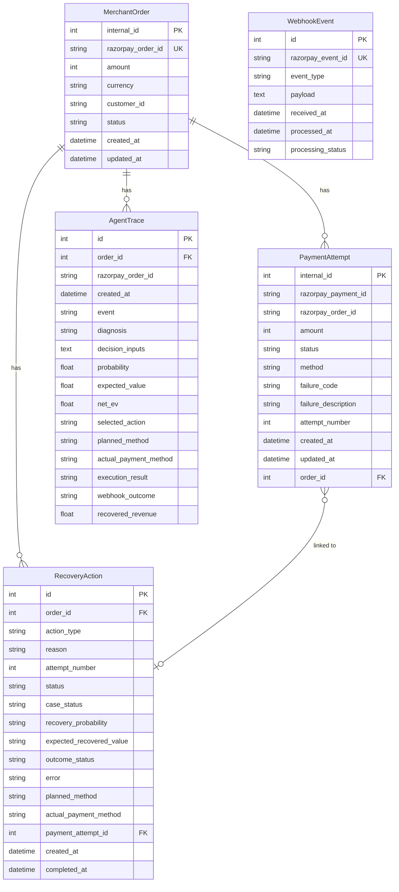

### RecoveryAction.action_type values

| action_type | Meaning |
|-------------|---------|
| `recovery_candidate` | (legacy) initial candidate |
| `abandonment_candidate` | checkout abandoned, no payment attempt |
| `recovery_retry_pending` | agent decided RETRY; awaiting capture |
| `recovery_waiting` | agent decided WAIT |
| `recovery_stop` | agent decided STOP |
| `recovery_exhausted` | max attempts reached |
| `recovery_success` | payment captured after intervention |

### MerchantOrder.status values

`created` -> `recoverable` / `abandoned` / `exhausted` / `stopped` -> `paid`

---

## 16. API Design

All routes served by FastAPI. Base URL: `http://localhost:8000`.

### Orders

| Method | Path | Description |
|--------|------|-------------|
| `POST` | `/orders` | Create order + Razorpay order |
| `GET` | `/orders` | List all orders |
| `GET` | `/orders/{internal_id}` | Get single order |

### Payments

| Method | Path | Description |
|--------|------|-------------|
| `GET` | `/payments/order/{id}/status` | Razorpay order/payment state |
| `POST` | `/payments/order/{id}/retry` | Record retry eligibility |
| `POST` | `/payments/order/{id}/abandon` | Mark checkout abandoned + agent trace |
| `GET` | `/payments/history/{id}` | Payment attempt history with AI data |
| `POST` | `/payments/final-state/{id}` | Resolve final payment state |
| `GET` | `/payments/candidates` | Recovery candidates with AI decisions |
| `GET` | `/payments/order/{id}/trace` | Agent trace for an order |
| `GET` | `/payments/customer/{id}/history` | Customer longitudinal history |
| `GET` | `/payments/order/{id}/voice-recovery` | Groq/fallback Hinglish recovery message |
| `GET` | `/payments/simulation/recovery-journeys` | 5-seed batch simulation |

### Webhooks

| Method | Path | Description |
|--------|------|-------------|
| `POST` | `/webhooks/razorpay` | HMAC-verified Razorpay webhook receiver |

### Dashboard

| Method | Path | Description |
|--------|------|-------------|
| `GET` | `/dashboard/metrics` | All merchant dashboard metrics |

### Simulation

| Method | Path | Description |
|--------|------|-------------|
| `GET` | `/simulation/baseline` | Seed-42 baseline vs AI benchmark |

### System

| Method | Path | Description |
|--------|------|-------------|
| `GET` | `/config` | Public Razorpay key ID |
| `GET` | `/health` | Health check |
| `GET` | `/` | Frontend `index.html` |

---

## 17. System Diagrams

### 17.1 High-Level Architecture

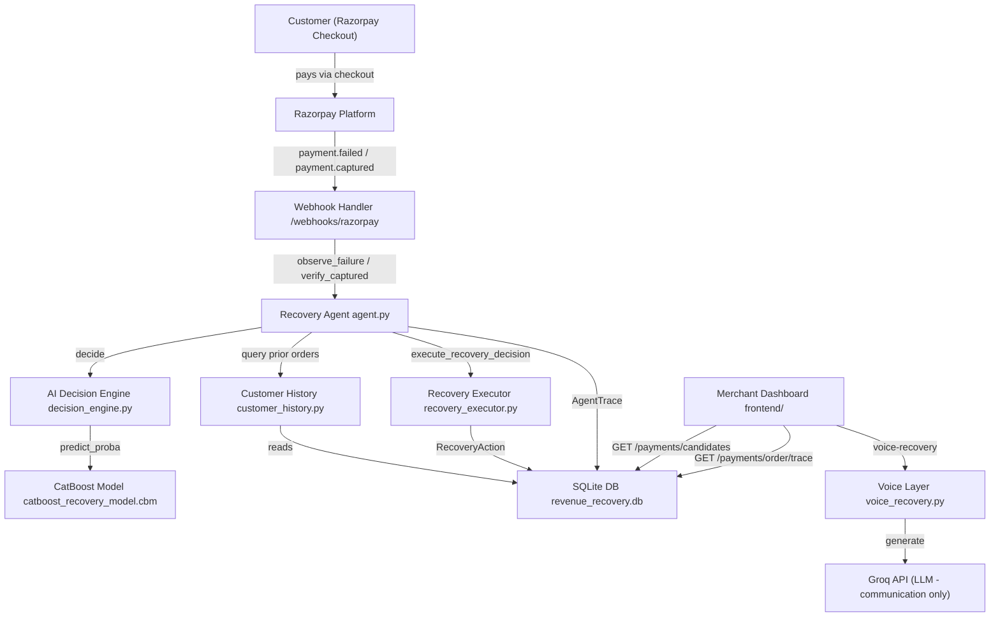

### 17.2 Agent Decision Loop

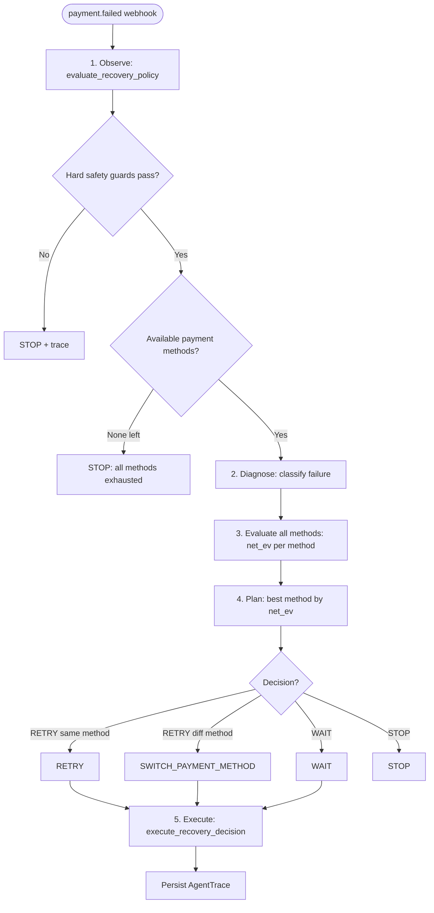

### 17.3 Expected Value Calculation

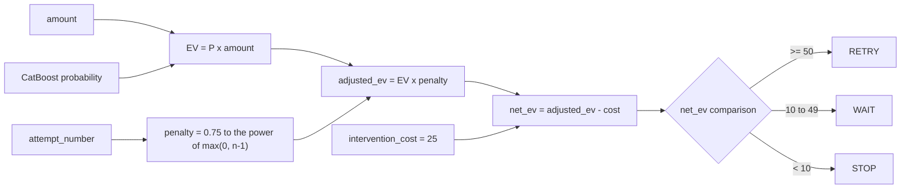

### 17.4 Razorpay Payment Lifecycle

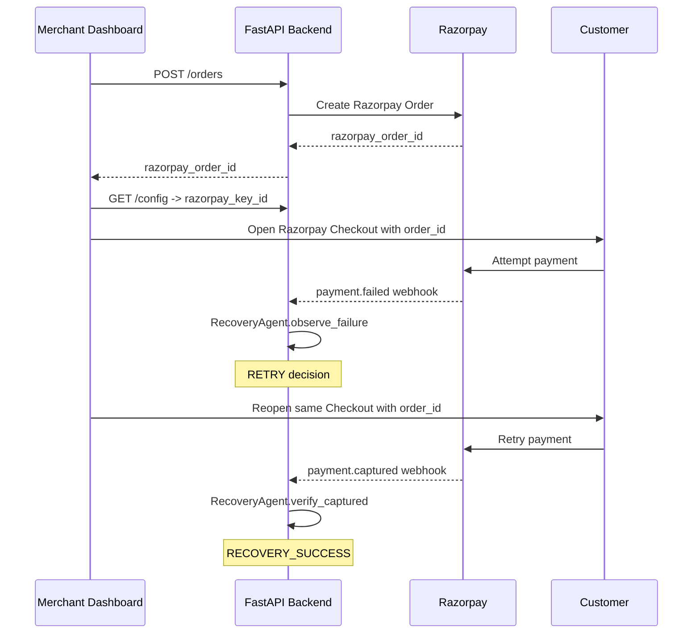

### 17.5 Recovery Attribution Decision

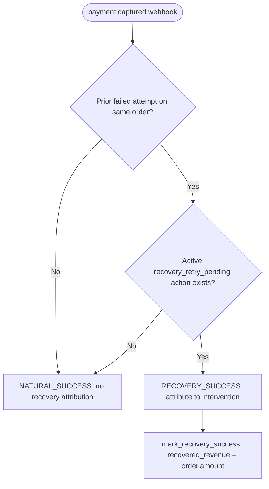

### 17.6 Longitudinal Customer History Data Flow

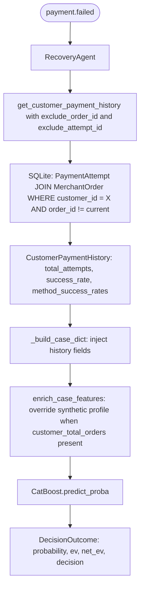

### 17.7 ML Training Pipeline

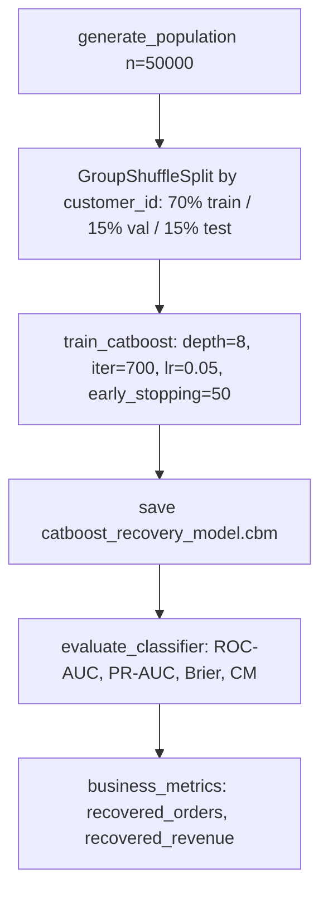

### 17.8 Synthetic Benchmark Comparison

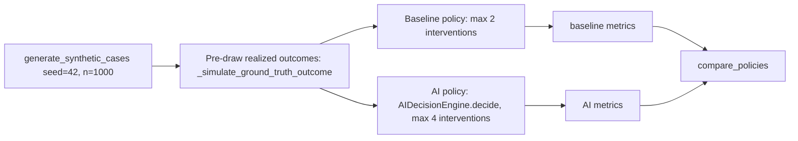

### 17.9 LLM Voice Layer

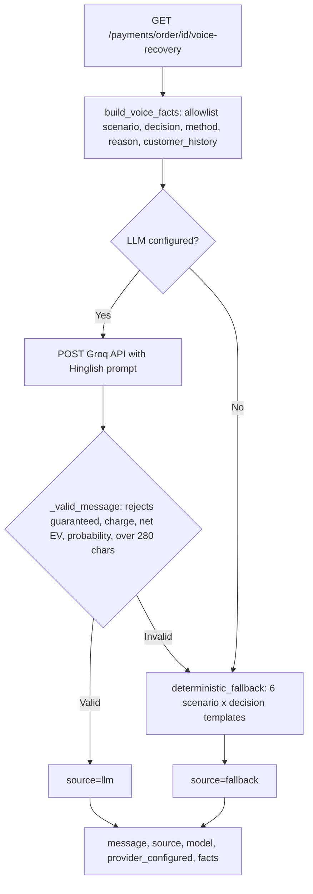

### 17.10 Dashboard Metrics Computation

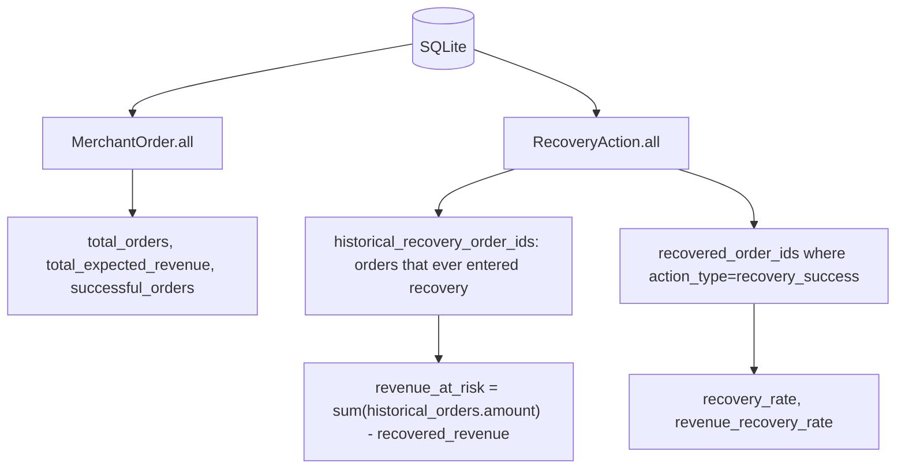

---

## 18. Non-Functional Requirements

| Requirement | Implementation |
|-------------|----------------|
| Idempotency | Webhook dedup by `razorpay_event_id`; `mark_recovery_success` guards against duplicates |
| Safety | Hard safety guards at engine + executor level; LLM cannot make financial decisions |
| Auditability | Full `AgentTrace` per decision; `WebhookEvent` raw payload stored |
| Reproducibility | CatBoost model saved; benchmark seed-locked at 42 |
| Bounded retry | `MAX_RECOVERY_ATTEMPTS = min(4, env_value)` hard cap |
| No fabrication | No `PaymentAttempt` created for abandonment; no payment assumed successful without webhook |
| Signature verification | HMAC-SHA256 on every webhook; rejects invalid `X-Razorpay-Signature` |
| Key isolation | No Razorpay secret or LLM key sent to frontend |
| Test coverage | 89 passing pytest tests across all layers |

---

## 19. Honest Limitations

| Area | Limitation |
|------|------------|
| Data | All training data is synthetic. The model has never seen real Razorpay production data. |
| Benchmark | Capability comparison, not pure ML quality. AI has structural advantages over baseline beyond the model itself. |
| EV model | `intervention_cost = 25` is a simplified assumption, not a real fee. |
| Scale | SQLite is not production-scale. Single-merchant, single-process. No async workers. |
| Voice | Voice synthesis uses client-side browser Web Speech API (`SpeechSynthesisUtterance` / `hi-IN`). Audio output depends on browser speech engine availability and active tab interaction. |
| Customer identity | `customer_id` is a developer-supplied string, not verified against real Razorpay records. |
| LLM dependency | Voice degrades gracefully to deterministic templates when Groq is unavailable. |
| Timing | `time_since_failure = 0` is hardcoded in live decisions (webhook arrival and decision are nearly simultaneous). |
| Attribution | Binary attribution only (RECOVERY_SUCCESS or NATURAL_SUCCESS). No partial or multi-touch attribution. |
| Concurrency | No locking on recovery action creation; duplicate actions possible under concurrent webhook delivery. |

---

## 20. Future Scope

> The following are **not implemented** in the current system. They are labeled clearly as future.

| Feature | Description |
|---------|-------------|
| Real merchant data training | Retrain CatBoost on real Razorpay webhook history with validated labels |
| Multi-merchant tenancy | Merchant-scoped DB + API key management |
| Outbound telephony / IVR | Automated phone calls with server-side TTS (e.g., Twilio/Exotel + Sarvam AI) |
| Proactive email/SMS | Outbound recovery links without agent/merchant involvement |
| A/B testing framework | Compare intervention strategies live with holdout groups |
| Online learning | Update model weights incrementally as outcomes arrive |
| Production DB | PostgreSQL with Alembic migrations |
| Better abandonment detection | Server-side session timeout + heartbeat |
| Webhook retry queue | Celery/Redis queue for reliable webhook processing under load |
| Full audit trail | Immutable append-only log for regulatory compliance |
| Cross-merchant intelligence | Aggregate failure patterns across merchants (with privacy controls) |
